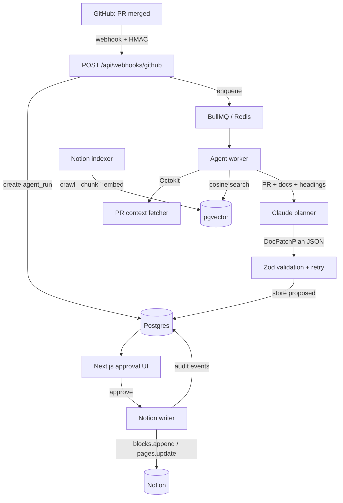

# Shadow Notino

**An agentic GitHub-to-Notion documentation system.** Shadow Notino watches
merged pull requests, analyzes the code changes, retrieves related Notion
engineering docs, proposes safe block-level documentation updates, asks for
human approval, and writes approved changes back into Notion.

> A technical writer agent living inside your Notion workspace.

Engineering docs go stale because teams ship code faster than they update the
wiki. Shadow Notino closes that gap — without ever silently editing your docs.

> **Full A–Z documentation:** [`docs/PRODUCT.md`](docs/PRODUCT.md) — architecture,
> data model, every component, API reference, setup, testing, and more.

---

## How it works

```
GitHub PR merged
  → webhook → BullMQ job
  → fetch PR diff + metadata
  → retrieve related Notion docs (pgvector)
  → Claude proposes a structured patch plan (Zod-validated)
  → human approves in the Next.js UI
  → Notion writer applies real block changes
  → every step recorded in the Postgres audit log
```

The LLM **never** writes to Notion. It only proposes a validated `DocPatchPlan`;
the backend applies approved actions. Human approval is mandatory.

## Architecture



Every important step writes an auditable `run_events` row: `webhook_received`,
`pr_fetched`, `docs_searched`, `patch_generated`, `patch_approved`,
`block_write_started`, `block_write_completed`, `write_failed`, `run_completed`.

## Tech stack

| Layer        | Tech                                                        |
| ------------ | ----------------------------------------------------------- |
| Frontend     | Next.js, React, TypeScript, Tailwind CSS                    |
| Backend      | Node.js, Express, TypeScript                                |
| Jobs         | BullMQ + Redis                                              |
| Data         | PostgreSQL + pgvector, Prisma                               |
| Integrations | Notion API, GitHub API + webhooks, Claude API              |
| Contracts    | Zod schemas in `@shadow/shared`                             |

## Repository layout

```
shadow-notino/
  apps/
    web/        Next.js app (landing, runs, approval UI, demo)
    api/        Express API, BullMQ worker, Prisma, services, scripts
  packages/
    shared/     Zod schemas + types shared across the boundary
  infra/
    docker-compose.yml   local Postgres (pgvector) + Redis
  docs/         BUILD_PLAN.md, SYSTEM_PROMPT.md
```

## Local setup

Prerequisites: Node 20+, pnpm 9, Docker.

```bash
# 1. Install deps
pnpm install

# 2. Configure env
cp .env.example .env   # fill in GitHub / Notion / Anthropic keys as you reach each phase

# 3. Start Postgres (pgvector) + Redis
pnpm infra:up

# 4. Apply the database schema
pnpm db:migrate

# 5. Run web + API (+ worker) together
pnpm dev
```

- Web: http://localhost:3000
- API: http://localhost:4000 (`/health` for a liveness + dependency check)

> The local Postgres is published on host port **5435** (see `infra/docker-compose.yml`)
> to avoid clashing with other Postgres instances; the API connects over that port.

## Notion setup

1. Create an internal integration at https://www.notion.so/my-integrations and
   copy its secret into `NOTION_API_KEY`.
2. Create a Notion page to hold the workspace, **share it with the integration**
   (`•••` → Connections), and put its id in `NOTION_PARENT_PAGE_ID`.
3. Seed the databases and sample docs, writing the resulting IDs back to `.env`:

   ```bash
   pnpm notion:seed --write-env   # creates Engineering Docs, Services, PR Updates,
                                  # Agent Runs, Doc Review Tasks + 3 sample docs
   pnpm notion:seed --verify      # re-checks IDs + required properties
   ```

4. Confirm the API can read them: `GET /api/notion/docs` lists the seeded docs
   live from Notion.
5. Index the docs into pgvector and try semantic search:

   ```bash
   pnpm notion:index                       # crawl → chunk → embed → pgvector
   pnpm notion:search "search fallback ranking"
   ```

   Embeddings run **locally** via Transformers.js (all-MiniLM-L6-v2, 384-dim) —
   no API key, offline. The ~90MB model downloads once on first run. Search is
   also exposed at `GET /api/notion/search?q=...`.

## Two-minute demo

1. `pnpm dev`, then open `http://localhost:3000/demo`.
2. **Verify** the Notion workspace → **Index docs** → **Replay PR #184**.
3. Watch the agent move through `fetching_pr → searching → planning → waiting_approval`.
4. **Open the run**, review the proposed callouts / code blocks / review task and the
   risks, then click **Approve and Write to Notion**.
5. The Notion page gains a "ranking fallback" callout, a config code block, and a
   verification to-do; a Doc Review Task is filed; the run is logged end to end.

The sample PR (`#184 — Add ranking fallback for slow search provider`) adds a
`fallback_strategy` param, a `SEARCH_FALLBACK_TIMEOUT_MS` config var, and a
`ranking_source` response field — exactly the kind of change that silently rots a
"Search Service API Reference" page.

## How the agent works

The planner receives the PR context, the top retrieved Notion docs, and the target
page's **real heading list**, then must return a single JSON `DocPatchPlan`. Three
guarantees keep it safe:

- **Grounded** — the backend forces `targetPageId`/`targetPageTitle` to a doc that
  retrieval actually returned, so the model can't invent or retarget a page.
- **Validated** — the output is parsed with Zod; on failure the agent retries once
  with the validation error fed back, then fails the run with a precise message.
- **Conservative** — low confidence produces a review task instead of an aggressive
  rewrite, and behavior that can't be proven from the diff becomes a verification to-do.

## Human-in-the-loop safety model

- The LLM only ever emits a `DocPatchPlan`; it has no Notion write access.
- Only backend code (`services/notion/writer.ts`) applies changes, and only after a
  human clicks approve. Rejected and edited patches are first-class.
- Every action is stored as a `patch_actions` row with its own status and any error,
  and every transition is in the audit log — nothing happens invisibly.

## Workflow

`main` is protected. All work lands through pull requests, gated by GitHub
Actions CI (lint/typecheck/build + a Prisma migration check against a real
Postgres service). See `.github/workflows/`.

## Limitations

- **MVP scope by design** — no OAuth, multi-tenant auth, or full GitHub App install;
  a single Notion integration token. The webhook is signature-verified but expects
  one workspace.
- **Embeddings are local** (all-MiniLM-L6-v2, 384-dim) for a zero-key demo; swap in
  OpenAI/Voyage by changing one module and the vector column dimension.
- **Heading match is top-level** — append actions target top-level headings; deeply
  nested sections fall back to appending at the end of the page.
- **Notion-dependent paths** (seed / index / plan / write) need real credentials;
  CI validates compile, build, and migrations, not live third-party calls.
- The agent worker runs **in-process** with the API in dev for one-command startup;
  in production run it standalone (`pnpm --filter @shadow/api worker`).

## Status

Built in phases (see `docs/BUILD_PLAN.md`):

- [x] **Phase 1** — Monorepo + infrastructure (`pnpm dev` runs web + API)
- [x] **Phase 2** — Notion workspace seeder (`pnpm notion:seed`, `--verify`)
- [x] **Phase 3** — GitHub webhook (signature-verified) + local replay endpoint
- [x] **Phase 4** — PR context fetcher (live GitHub API + demo fixture fallback)
- [x] **Phase 5** — Notion indexer + semantic search (local embeddings, pgvector)
- [x] **Phase 6** — Agent planner (Claude → Zod-validated DocPatchPlan, retry-on-invalid)
- [x] **Phase 7** — Approval UI (`/runs`, `/runs/:id` with diff, actions, approve/reject)
- [x] **Phase 8** — Notion writer (heading-targeted append, review tasks, status, retry)
- [x] **Phase 9** — Guided demo page (`/demo`: verify → index → replay → approve)
- [x] **Phase 10** — Polish (architecture diagram, safety model, limitations, README)

**Definition of done — met:** merge/replay a PR → agent run starts → related Notion
doc retrieved → patch plan generated → user approves → Notion page updates → audit
log records every change.

## Resume bullets

- Built an agentic GitHub-to-Notion documentation system that watches merged pull
  requests, analyzes code diffs, retrieves related engineering docs, and proposes
  block-level Notion updates for human approval.
- Implemented a Notion workspace indexer that recursively reads page block trees,
  embeds documentation into **pgvector**, and retrieves outdated docs related to
  changed services and API files.
- Designed a structured agent planner using the **Claude API** and **Zod** schemas to
  generate safe documentation patch plans (callouts, code blocks, review tasks, doc
  status) with grounded targeting and retry-on-invalid validation.
- Built a **Next.js** approval dashboard and a queued **BullMQ** pipeline that applies
  approved block mutations through the Notion API while preserving a Postgres audit
  log of every agent run.

## License

Portfolio project. All rights reserved unless stated otherwise.
