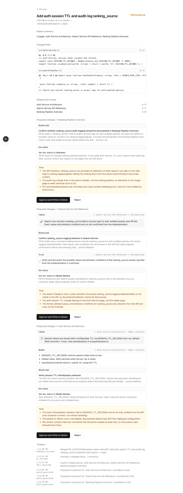
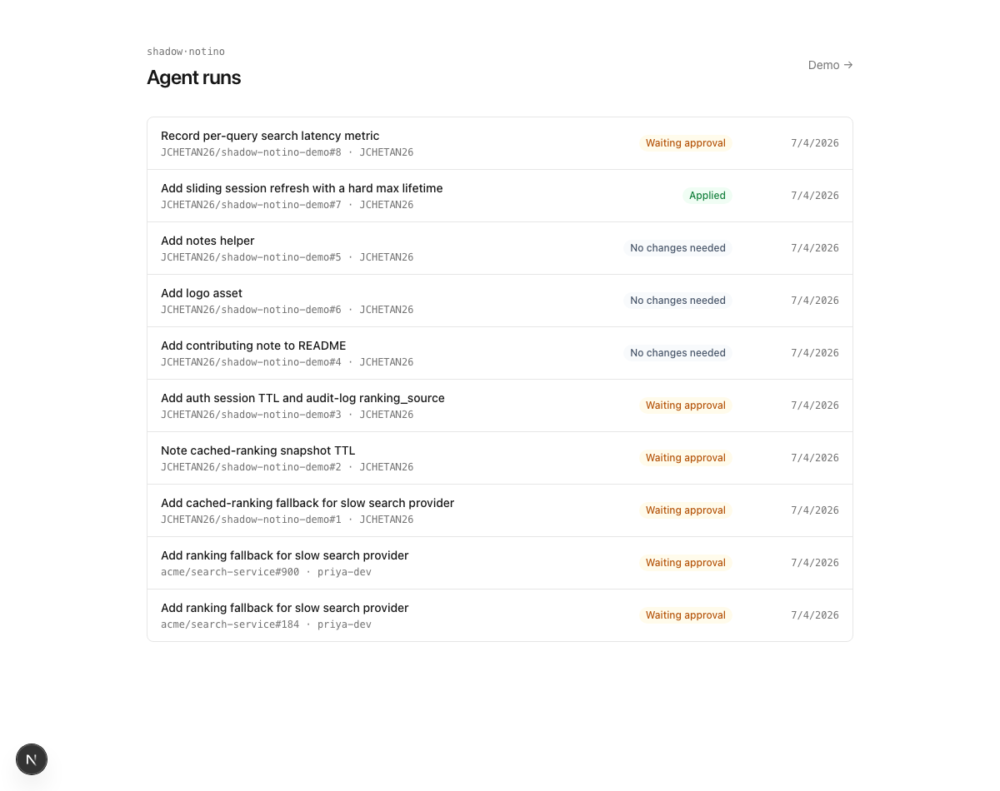
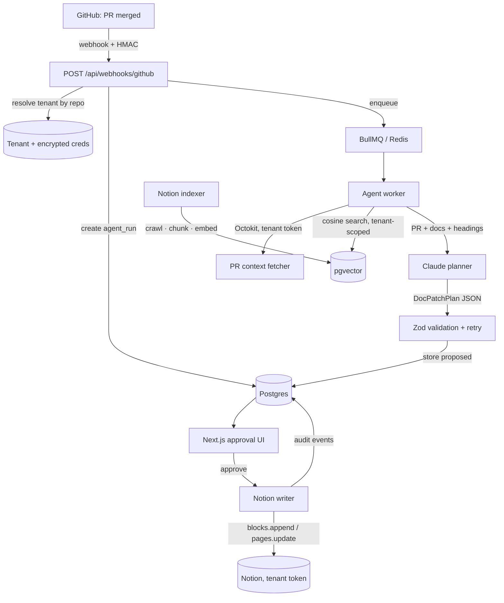
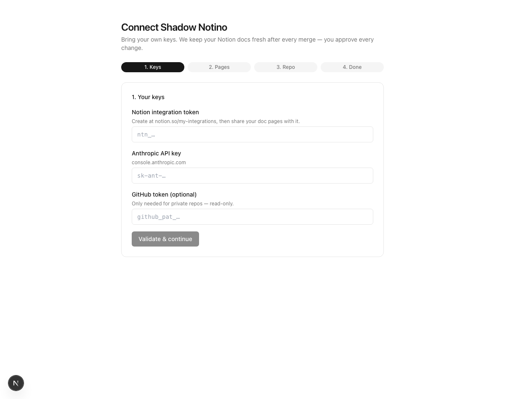

<div align="center">

# Shadow Notino

### Keep your Notion engineering docs true after every merge — without ever silently touching them.

Shadow Notino is a GitHub → Notion documentation agent. It watches merged pull
requests, reads the actual diff, finds the Notion docs that change affects, and
proposes precise, block-level edits — which **a human approves** before anything
is written. Bring your own keys; read-only on your repos; every change is yours to accept.

[](https://github.com/JCHETAN26/Shadow-Notinos/actions/workflows/ci.yml)


</div>

---

## Table of contents

- [The problem](#the-problem)
- [What makes it different](#what-makes-it-different)
- [See it in action](#see-it-in-action)
- [How it works](#how-it-works)
- [Features](#features)
- [Safety & security model](#safety--security-model)
- [Onboarding (bring your own keys)](#onboarding-bring-your-own-keys)
- [Quickstart (run it locally)](#quickstart-run-it-locally)
- [Architecture](#architecture)
- [Configuration](#configuration)
- [Testing & production readiness](#testing--production-readiness)
- [Project status & roadmap](#project-status--roadmap)
- [Limitations & non-goals](#limitations--non-goals)
- [Documentation](#documentation)
- [Contributing & workflow](#contributing--workflow)
- [License](#license)

---

## The problem

Engineering docs rot because teams ship code faster than they update the wiki. A
merged PR can change an API endpoint, a config variable, a response shape, or a
failure mode — and the Notion page describing that service silently goes stale.

Notion's own GitHub integration doesn't help here: it mirrors PR/issue **metadata**
into a database, but it never reads a diff and **never edits the prose** of your
docs. It also asks for **read/write across all your repositories** — a permission
ask many teams won't make.

Shadow Notino solves the part that's actually painful — **keeping the doc content
correct** — with the smallest footprint possible and a human in the loop.

## What makes it different

|  | Notion's native GitHub integration | **Shadow Notino** |
|---|---|---|
| Operates on | PR/issue **metadata** → database rows | PR **diff** → **doc prose** |
| Understands the code change | No | Yes (an LLM reads the diff) |
| Keeps doc *content* accurate | No | **Yes** |
| GitHub permissions | Read/write **all** repos | **Read-only**, the repos you choose |
| Writes to Notion | Syncs whole rows | **Append-only**, only pages you pick, **human-approved** |
| Plan requirement | Business tier | Any plan (bring your own keys) |

The wedge in one line: **it does the doc-maintenance the native integration
ignores, with minimal read-only access and a mandatory human approval on every write.**

## See it in action

**The review UI — every proposed change, grouped by doc, with the risks spelled out. Nothing is written until you click Approve.**



**The runs dashboard**



## How it works

```
GitHub PR merged
  → webhook (HMAC-verified, routed to the owning tenant)
  → BullMQ job
  → fetch the real PR diff (Octokit, size-bounded)
  → retrieve the affected Notion docs (pgvector semantic search)
  → Claude proposes a structured, Zod-validated DocPatchPlan
  → a human reviews & approves in the Next.js UI
  → the Notion writer applies real block changes (rate-limited, append-only)
  → every step recorded in the Postgres audit log
```

The LLM **never** writes to Notion. It only ever emits a validated `DocPatchPlan`;
backend code applies approved actions. Human approval is mandatory.


```mermaid
flowchart TD
    GH[GitHub: PR merged] -->|webhook + HMAC| WH[POST /api/webhooks/github]
    WH -->|resolve tenant by repo| T[(Tenant + encrypted creds)]
    WH -->|create agent_run| PG[(Postgres)]
    WH -->|enqueue| Q[BullMQ / Redis]
    Q --> W[Agent worker]
    W -->|Octokit, tenant token| PRC[PR context fetcher]
    W -->|cosine search, tenant-scoped| VEC[(pgvector)]
    IDX[Notion indexer] -->|crawl · chunk · embed| VEC
    W -->|PR + docs + headings| LLM[Claude planner]
    LLM -->|DocPatchPlan JSON| ZOD[Zod validation + retry]
    ZOD -->|store proposed| PG
    PG --> UI[Next.js approval UI]
    UI -->|approve| WR[Notion writer]
    WR -->|blocks.append / pages.update| NOTION[(Notion, tenant token)]
    WR -->|audit events| PG
```

## Features

- **Reads the actual diff.** Fetches the real PR diff via the GitHub API, trimmed to
  a bounded size so a 5,000-line PR can't blow the model's context window.
- **Finds the right docs (semantic).** pgvector + local embeddings map a code change
  to the Notion page(s) it affects.
- **Multi-page.** One PR can propose edits across several docs at once.
- **Branch-aware placement.** Merges to your **release branch** edit the live doc
  body; merges to any other branch are staged under a collapsible **"Pending changes"**
  toggle — so the doc body never claims unreleased behavior shipped. Promote a staged
  change into the body when it ships, or dismiss it.
- **Human-approved, always.** Nothing reaches Notion without a click. Per-plan
  approve / reject, with the proposed edits, target page, and risks shown up front.
- **Conservative & honest.** Low confidence produces a review task instead of an
  aggressive rewrite; behavior that can't be proven from the diff becomes a
  verification to-do; and it can conclude **"nothing to update"** and close clean.
- **Append-only writes.** Content is inserted after the matching heading or at page
  end — it never edits or deletes your surrounding blocks (toggles, callouts, databases).
- **Robust webhooks.** HMAC-signature verified, **idempotent** (duplicate deliveries
  don't double-run), **path-gated** (only PRs touching configured paths run), and
  **ghost-guarded** (empty / binary-only PRs skip before any LLM call).
- **Rate-limited & resilient.** A proactive ~3 req/s Notion limiter plus 429/5xx
  retries and clear, actionable error messages (e.g. access revoked mid-write).
- **Full audit trail.** Every run is a timeline of `run_events` — which PR, what was
  proposed, who approved, when.
- **Multi-tenant, bring-your-own-keys.** Each user supplies their own Notion /
  Anthropic / GitHub keys (encrypted at rest); tenants are fully isolated.

## Safety & security model

Safety is the product, not a footnote.

- **The agent proposes; a human disposes.** The LLM has no Notion write access — it
  only emits a `DocPatchPlan`. Only `services/notion/writer.ts` writes, and only after approval.
- **Grounded output.** The server forces `runId`, `targetPageId`, and `placement`
  server-side, so a malicious or confused model **cannot retarget a page or change
  where an edit lands**.
- **No destructive action exists.** The output schema only allows additive block
  types — there is no "delete" or "overwrite" for the model to emit, even under a
  successful prompt-injection.
- **Prompt-injection hardened.** Untrusted PR content is fenced and sanitized; a
  hostile-PR fixture keeps the test repeatable. (An injected "ignore all instructions"
  comment produced zero malicious actions.)
- **Webhook authentication.** Every delivery's `X-Hub-Signature-256` is verified
  against the owning tenant's secret before anything runs.
- **Encryption at rest.** Stored per-tenant credentials are AES-256-GCM encrypted
  (key from `MASTER_KEY` / a KMS in production).
- **Tenant isolation.** A tenant can only ever retrieve and edit its own indexed
  docs — verified with two tenants holding identical doc text.

See [`docs/PRODUCTION_READINESS.md`](docs/PRODUCTION_READINESS.md) for the full audit
against a 12-point production checklist.

## Onboarding (bring your own keys)

A self-serve wizard at `/onboarding` — no config files, no code. A user pastes their
own keys, picks the docs to keep fresh, connects a repo, and gets a webhook URL.



1. **Keys** — paste your Notion integration token + Anthropic key (+ optional GitHub
   token for private repos). Both are **live-validated** on the spot.
2. **Pages** — pick which of your shared Notion pages the agent should keep fresh.
3. **Repo** — your `owner/repo`, release branch, and optional path filters.
4. **Done** — we create your (isolated) tenant, index your pages, and hand you the
   **webhook URL + secret** to add in your repo settings.

Your keys are encrypted at rest; your LLM usage runs on **your** Anthropic key.

## Quickstart (run it locally)

**Prerequisites:** Node 20+, pnpm 9, Docker.

```bash
# 1. Install
pnpm install

# 2. Configure
cp .env.example .env      # fill in the keys below (see Configuration)

# 3. Start Postgres (pgvector) + Redis
pnpm infra:up

# 4. Apply the schema
pnpm db:migrate

# 5. Run web + API + worker together
pnpm dev
```

- Web: **http://localhost:3000** · API: **http://localhost:4000** (`/health` for a liveness + dependency check)
- The local Postgres is published on host port **5435** (see `infra/docker-compose.yml`) to avoid clashing with other instances.

**Seed a demo workspace** (creates sample Notion docs + indexes them):

```bash
pnpm --filter @shadow/api exec tsx src/scripts/notion-seed.ts --write-env   # create demo docs, write ids to .env
pnpm --filter @shadow/api exec tsx src/scripts/notion-index.ts              # embed into pgvector
```

Then open **`/demo`**, replay the sample PR, and approve the proposed changes — the
Notion page updates live. (Embeddings run **locally** via Transformers.js —
all-MiniLM-L6-v2, 384-dim, no key, ~90 MB downloaded once.)

## Architecture

**Monorepo** (pnpm workspaces):

```
shadow-notino/
├── apps/
│   ├── web/     Next.js app — landing, /onboarding wizard, /runs approval UI, /demo
│   └── api/     Express API, BullMQ worker, Prisma, services, scripts
├── packages/
│   └── shared/  Zod schemas + types shared across the boundary (@shadow/shared)
├── infra/
│   └── docker-compose.yml   local Postgres (pgvector) + Redis
└── docs/        PRODUCT.md, SPEC_V2.md, PRODUCTION_READINESS.md, SAAS_PLAN.md, …
```

**Tech stack**

| Layer | Tech |
|-------|------|
| Frontend | Next.js 15, React, TypeScript, Tailwind CSS |
| Backend | Node.js, Express, TypeScript |
| Jobs | BullMQ + Redis |
| Data | PostgreSQL + pgvector, Prisma |
| Embeddings | Transformers.js (all-MiniLM-L6-v2, local, 384-dim) |
| Integrations | Notion API, GitHub API + webhooks, Claude (Anthropic) API |
| Contracts | Zod schemas in `@shadow/shared` |
| Crypto | AES-256-GCM for stored credentials |

**The core contract — `DocPatchPlan`.** The planner must return a single JSON object:
a target page, a confidence, a summary, risks, and a list of typed **actions**
(`append_callout`, `append_bullets`, `append_code_block`, `append_todo`,
`create_review_task`, `update_doc_status`). It's Zod-validated with one retry-on-invalid;
identity and placement fields are forced server-side. Full data model and API reference:
[`docs/PRODUCT.md`](docs/PRODUCT.md).

## Configuration

Copy `.env.example` → `.env`. For the default single-tenant / local demo, credentials
come from env; in multi-tenant mode each tenant supplies its own (encrypted) keys.

| Variable | Purpose |
|----------|---------|
| `DATABASE_URL` | Postgres (pgvector) connection string |
| `REDIS_URL` | Redis / BullMQ |
| `NOTION_API_KEY` | Notion integration token (default tenant) |
| `NOTION_PARENT_PAGE_ID` | Page under which the seeder creates demo databases |
| `ANTHROPIC_API_KEY` | Claude API key |
| `CLAUDE_MODEL` | Planner model (default `claude-opus-4-8`) |
| `GITHUB_TOKEN` | GitHub API token (private repos / higher rate limits) |
| `GITHUB_WEBHOOK_SECRET` | HMAC secret for webhook verification |
| `RELEASE_BRANCH` | Branch whose merges edit the doc body (default `main`) |
| `DOC_TRIGGER_PATHS` | Glob allowlist — only matching PRs run (empty = all) |
| `NOTION_MAX_RPS` | Proactive Notion rate limit (default 3) |
| `MASTER_KEY` | 32-byte hex key for AES-256-GCM credential encryption |
| `PUBLIC_API_URL` | Public base URL — used to hand tenants their webhook URL |

## Testing & production readiness

- **CI** on every PR: lint · typecheck · build, plus a Prisma migration check against
  a real Postgres service. `main` is protected; everything lands via PR.
- **Real-GitHub test matrix** (verified against a live demo repo): signature rejection,
  non-merged ignore, idempotency, `dev`→pending placement, multi-service multi-page,
  no-op close, prompt-injection (no hijack), binary-only ghost-guard.
- **Hardening pass**: webhook idempotency, ghost-PR short-circuit, proactive rate
  limiter, prompt-injection defenses, massive-PR budget, graceful Notion errors.
- Full audit: [`docs/PRODUCTION_READINESS.md`](docs/PRODUCTION_READINESS.md).

> Notion-dependent write paths require real credentials, so they're validated by
> running the app (and are exercised end-to-end in the demo) rather than in CI.

## Project status & roadmap

**Status: a functionally complete, multi-tenant BYOK proof-of-concept — proven end
to end locally** (real PR → real webhook → real Claude plan → human approval → real
Notion blocks, including the branch-aware toggle + promote flow).

- [x] Core pipeline (webhook → retrieval → planner → approval → writer + audit log)
- [x] Branch-aware placement, multi-page planning, no-op close
- [x] Production hardening (idempotency, rate limiting, injection defenses, …)
- [x] Multi-tenant BYOK: encrypted credentials, per-tenant routing & keys, tenant isolation
- [x] Self-serve onboarding wizard
- [ ] **Deploy** to a public host (the one gate to external users)
- [ ] **Auth** on the onboarding endpoints (invite gate → GitHub OAuth)
- [ ] **GitHub App** for one-click, read-only repo connection (replaces the manual webhook)
- [ ] Notion integration-gallery submission (OAuth public integration)

The path from "works locally" to "live for users" and the SaaS plan:
[`docs/SAAS_PLAN.md`](docs/SAAS_PLAN.md).

## Limitations & non-goals

- **Not yet hosted** — runs locally; a public deployment is the next step for real users.
- **Onboarding endpoints are unauthenticated** until the auth gate lands — fine for
  local / invited use, must be gated before public exposure.
- **Not a metadata sync** — it stays in the doc-content lane; PR/issue database sync is
  the native integration's job (and complementary).
- **Heading match is top-level** — append actions target top-level headings; deeply
  nested sections fall back to appending at page end.
- **Local embeddings by design** (all-MiniLM-L6-v2) for a zero-key setup; swap in a
  hosted embedder by changing one module + the vector dimension.

## Documentation

| Doc | What's in it |
|-----|--------------|
| [`docs/PRODUCT.md`](docs/PRODUCT.md) | The A–Z reference: architecture, data model, every component, API, CLI |
| [`docs/SPEC_V2.md`](docs/SPEC_V2.md) | The v2 functional spec (branch-aware docs, gating, multi-page) |
| [`docs/PRODUCTION_READINESS.md`](docs/PRODUCTION_READINESS.md) | 12-point production audit + hardening record |
| [`docs/SAAS_PLAN.md`](docs/SAAS_PLAN.md) | The BYOK / multi-tenant / publishable-connector roadmap |
| [`docs/SYSTEM_PROMPT.md`](docs/SYSTEM_PROMPT.md) · [`docs/BUILD_PLAN.md`](docs/BUILD_PLAN.md) | Original specs |

## Contributing & workflow

`main` is protected — all work lands through pull requests gated by CI
(lint/typecheck/build + a Prisma migration check). Branch, PR, green CI, squash-merge.
Prefer small, focused PRs; match the surrounding code style.

## License

**Proprietary — © 2026. All rights reserved.** Not licensed for redistribution.
(Open-sourcing under a permissive license is an option if the project goes that way.)

---

<div align="center">
<sub>Built to feel like a plausible Notion feature — a technical writer that lives in your workspace and keeps the docs honest after every merge.</sub>
</div>
